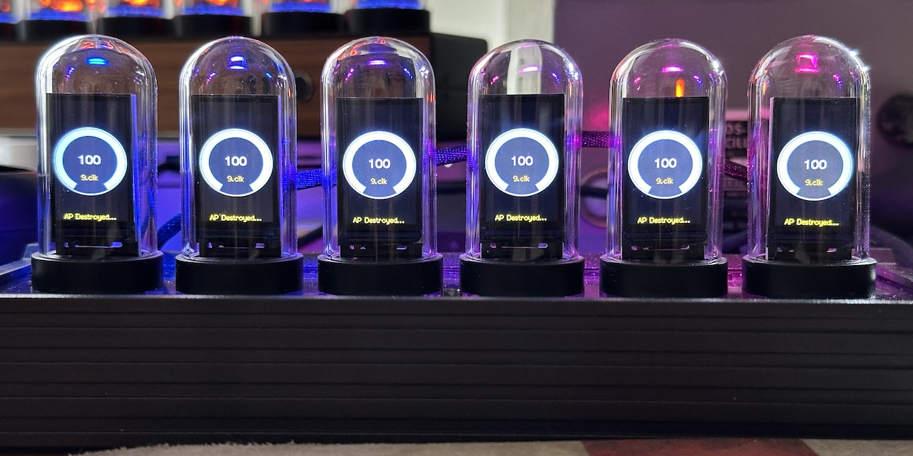
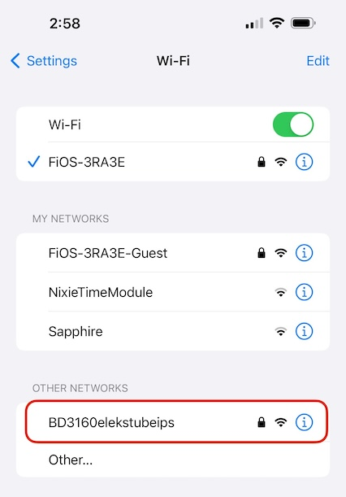
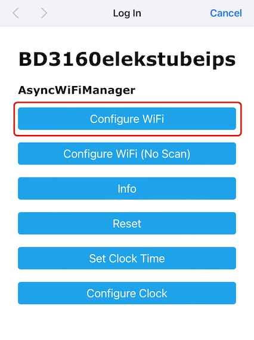
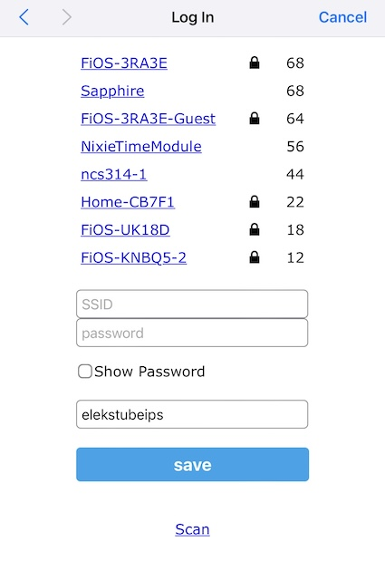
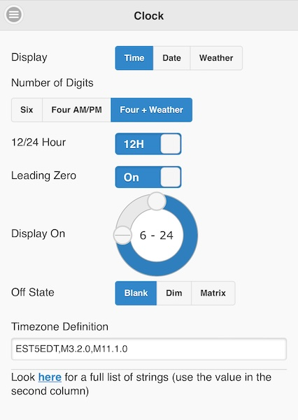
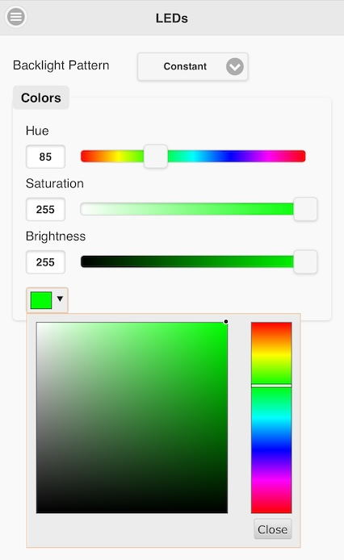

# EleksTubeIPS - An aftermarket custom firmware for the EleksTube IPS clock

[Original documentation and software from EleksMaker.](https://wiki.eleksmaker.com/doku.php?id=ips)

This code wouldn't exist without the work done by the people on [this reddit discussion](https://wiki.eleksmaker.com/doku.php?id=ips).

This code requires platform.io to build. The benefits of doing this are:

* The library dependencies are handled automatically
* The correct ESP32 board and the binary sizes are pre-defined
* You don't have to modify any files in TFT_eSPI
* The images and HTML files can be built and uploaded directly in the IDE.

## Features of This Firmware

This firmware uses the WiFi support that your clock already has:
* It synchronizes the time with NTP so it is very accurate.
* It automatically handles timezone and DST conversions.
* All clock configurarion is done usng a web interface.
  * Set the timezone information
  * Set the hours the clock is on
  * Enable/disable leading zeros
  * Display the date
  * Set the date format
  * Set the backlight effects and colors
  * Select which clock face is used
  * Upload additional clock faces
  * Delete unused clock faces

# Hardware modification

Original EleksTube has a few problems in the hardware design. Most notably it forces 5V signals into ESP32 which is not happy about it. And it is outside of safe operating limits.

## Conversion

CH340 chip, used for USB-UART conversion can operate both on 5V and 3.3V. On the board it is powered by 5V. Cut one trace on the bottom side of the board that supplies the chip with 5V and route 3.3V over the resistors / capacitors to VDD and VREF.

See folder "docs" for the photo.

# Backup first!

If you mess-up your clock, it's only your fault. Backup images from other uses DO NOT WORK as the firmware is locked by MAC address of ESP32.

## Install the USB Serial Port Device Driver

[EleksTube instructions](https://wiki.eleksmaker.com/doku.php?id=ips) instruct for installing a serial port driver.

On Windows 10, plug-in the cable and run Windows Update. It will find and install the driver.

On Linux and Mac it works out of the box.

## Save your original FW

### Linux/Mac

* Install [esptool.py](https://docs.espressif.com/projects/esptool/en/latest/esp32/). On Mac I used [homebrew](https://brew.sh/) to install it.
* Figure out what the port is, and use esptool.py to read the image. For me:
  esptool.py --port /dev/cu.usbserial-120 read_flash 0x00000 0x400000 backup1.bin

### windows

* Use the same process as for Linux above or...
* Download the esp32 flash download tool and use it as document in [this reddit discussion](https://community.platformio.org/t/export-of-binary-firmware-files-for-esp32-download-tool/9253).

# How to build this firmware

These instructions assume you already know how to use platform.io, and just need to know WHAT to do.

## Download this code

You're either reading this file after downloading it already, or you're reading it on github.  I'll assume you can figure out how to get the code from github and put it somewhere on your local machine.  This is your preference.

## Setup Platform IO

If you don't already have platform.io installed, go to [https://platformio.org/](https://platformio.org/install/ide?install=vscode) and follow the instructions there. This project uses the VSCode version.

### Modify platformio.ini

* Change _upload_port_ and _monitor_port_ to match whatever port your clock is plugged in to.
* For "SI HAI clock" also add RTC by Makuna (developed on 2.3.5) https://github.com/Makuna/Rtc/wiki

## Upload New Firmware

Connect the clock to your computer with USB.

### Upload SPIFFS

In the alien tab, under esp32dev/Platform, select *Upload Filesystem Image*. It should download all the tools it needs and upload the result.

### Compile and Upload the Code

Once the SPIFFS have uploaded, build and upload the code - In the alien tab, under esp32dev/General select *Upload and Monitor*. It will build the binary and upload it. The clock will restart and the display will looks something like this:

After that it should display the time, though the timezone may be incorrect (you can change this after you have connected the clock to WiFi).

# Configure your WiFi network

The first time the clock runs this firmware, it will create an access point. Connect to it and you should be taken to a captive portal where you can configure your WiFi network details (sometimes you might need to connect to the AP more than once). The AP will have a name that ends in *elekstubeips*:

The captive portal displays this page. Click on the *Configure WiFi* button:

After clicking on the *Configure WiFi* button you should see a page like this that lists all of the routers/access points that you can connect to. Select yours and enter the password. You can also change the hostname (change *elekstubeips* to whatever you want). The *Scan* link will make it re-populate the list of access points:

After you have connected successfully you should see this page (the clock will also display the clock's IP address for 5 seconds):

# Configuring the Clock

Remember that hostname in the config portal? Go to [elekstubeips.local](http://elekstubeips.local) (or *whateverhostnameyouentered*.local) and you will see this display. If the device you are on doesn't recognize *.local* hostnames, you will need the IP address that is displayed briefly when the clock connects to WiFi (if you don't remember it, just unplug the clock and plug it back in).

You can set the clock display format using the clock menu. All changes are immediately reflected in the clock display. A key field here is the *Timezone Definition*, this sets the timezone and the DST rules. Follow the link on the GUI to find the right string for your location:

Clicking on the three bars at the top left allows you to navigate to additional screens. This is the leds screen:

This screen allows you to change the clock face.
* The current clock face is hilighted in blue, click on another one to change it. Changing takes a few seconds (it has to unzip the new clock face), you will see the circular meters displayed showing the progress.
* You can upload additional clock faces by clicking on the *Upload* button.
* You can delete clock faces by clicking on the trash can icon.

## Clock Faces
Clock faces have to be in *.tar.gz* format - if you're on a Mac or Linux you can use a command line shell to create these, otherwise there are online tools such as [this one](https://archive.online-convert.com/convert-to-gz).

All of the ones in the image above are in the data/ips/faces directory of this project, so if you delete them from the clock you can just upload them again from there.

Each file contains 10 images *0.bmp* through *9.bmp*. These can be 1, 4, 8, 16 or 24 bit BMP files. I have included a python script in the tools directory that can convert most graphic files to one of the formats the clock can use. It takes a list of files as input and has multiple options to control how the conversion is done. Run it with the -h option to see them all.

The name that appears in the GUI is just the filename with the *.tar.gz* extension removed.
